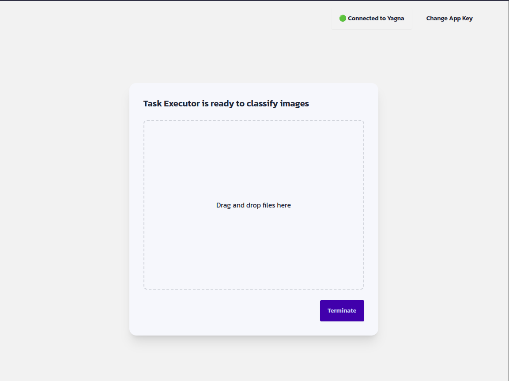

# Object detection with Golem - An example React application that interacts with the Golem network.

The purpose of this example is to show how to interact with a local Yagna node from a React application. The application is a simple image classifier that uses a pre-trained model to detect objects in an image. The source of the Golem image containing the model is the [/detr-golem-image-source](/detr-golem-image-source/) directory.

The application is built with [Vite](https://vitejs.dev/) and [React](https://reactjs.org/). It uses [Golem React SDK](https://npmjs.com/package/@golem-sdk/react) to interact with the Golem network. For styling, it uses [Tailwind CSS](https://tailwindcss.com/) and [DaisyUI](https://daisyui.com/).

## Documentation

To get started with the Golem React SDK, please refer to the [documentation](https://docs.golem.network/docs/creators/javascript/react).

## Local setup

1. Clone the repository
1. Install dependencies with `npm install`
1. Start the local Yagna node with `yagna service run --api-allow-origin='localhost:5173'`
1. Start the application with `npm run dev`

You can now access the application at http://localhost:5173.
